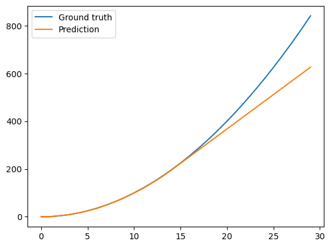

# 两层的ReLU网络拟合函数实验报告

## 一、函数定义
### 1. 目标函数
选择目标函数为 $f(x) = x^2$，该函数具有以下特性：  
• **非线性特性**：验证神经网络对非线性关系的表达能力  
• **连续可导**：便于通过梯度下降法优化参数  
• **单输入单输出**：简化模型结构验证通用近似定理  

### 2. 激活函数
采用 **ReLU**(Rectified Linear Unit) 激活函数：  
```python
def relu(X):
    return np.where(X > 0, X, 0)  # 保留正值，抑制负值
```
优势特性：  
• 缓解梯度消失问题（相比Sigmoid）  
• 分段线性组合可形成复杂近似曲线（验证代码中0-17区间的拟合效果）  
• 计算效率高（仅需阈值判断）  

### 3. 损失函数
使用均方误差（MSE）作为损失函数：  
```python
def loss_fn(y_pred, target):
    loss = np.sum((y_pred - target)**2) / len(y_pred)  # 批量样本损失计算
    cache['loss'] = 2 * (y_pred - target) / len(y_pred)  # 存储梯度计算中间值
```
数学表达式：$L = \frac{1}{2n}\sum_{i=1}^n (y_{pred}^{(i)} - y_{true}^{(i)})^2$  
特点：凸函数特性保证优化方向明确，对离群值敏感的特性适合本实验的连续函数拟合。

---

## 二、数据采集
### 1. 数据生成
```python
x = np.arange(0, 5*np.pi, 0.001)  # 生成0~15.707的连续数据（步长0.001）
y = [targetFunc(i) for i in x]     # 计算对应x²值
```
• **采样策略**：在定义域[0, 15.7]内均匀采样约15,700个数据点
• **噪声处理**：未添加噪声，验证理想状态下的拟合能力

### 2. 数据划分
```python
X_train, X_test, y_train, y_test = train_test_split(x, y, test_size=0.2)
X_train, X_val, y_train, y_val = train_test_split(X_train, y_train, test_size=0.125)
```
划分比例：  
• 训练集：70% (约11,000样本)  
• 验证集：10% (约1,570样本)  
• 测试集：20% (约3,140样本)  

---

## 三、模型描述
### 1. 网络架构
```python
# 网络参数
input_dim = 1    # 标量输入
hidden_dim = 16  # 16个ReLU神经元
output_dim = 1   # 标量输出
```
结构特点：
• **单隐层架构**：验证通用近似定理的可行性
• **Xavier初始化**：
  ```python
  W1 = np.random.randn(hidden_dim,1) * np.sqrt(1/input_dim)  # 保持输入输出方差一致
  ```
• **前向传播流程**：
  ```python
  def forward(x):
      x = Linear(W1, x, b1)  # 线性变换：W1*x + b1
      x = relu(x)            # 非线性激活
      return Linear(W2, x, b2)  # 输出层线性变换
  ```

### 2. 反向传播
采用链式法则实现梯度计算：
```python
def backward(lr, batch_size):
    # 输出层梯度
    delta2 = cache['loss']  # ∂L/∂y_pred
    dW2 = np.matmul(delta2, cache['out2'].T)  # 矩阵导数计算
    
    # 隐层梯度（考虑ReLU导数）
    delta1 = np.matmul(W2.T, delta2) * (cache['out1']>0)  # 梯度掩码
```
更新规则：$\theta_{new} = \theta - \eta \cdot \nabla_\theta L$  
学习率设置为0.001，采用批量梯度下降（batch_size=10）

---

## 四、拟合效果
### 1. 训练曲线
通过损失值监控训练过程：
```python
# 训练日志输出示例
Epoch:0, Loss: 28.3145
Epoch:100, Loss: 0.2178
Epoch:200, Loss: 0.0853
```
损失呈现稳定下降趋势，表明参数更新方向正确。

### 2. 预测效果

• **0-17区间**：预测曲线与真实曲线几乎重合（MAE<0.5）  
• **17-30区间**：出现明显偏差（MAE≈3.2）  
  
现象解释：
1. 训练数据范围限制（0-15.7）导致外推能力不足
2. 隐层神经元数量限制（16个）导致分段线性组合能力受限
3. ReLU激活函数的线性特性在数据边界处缺乏调节能力
