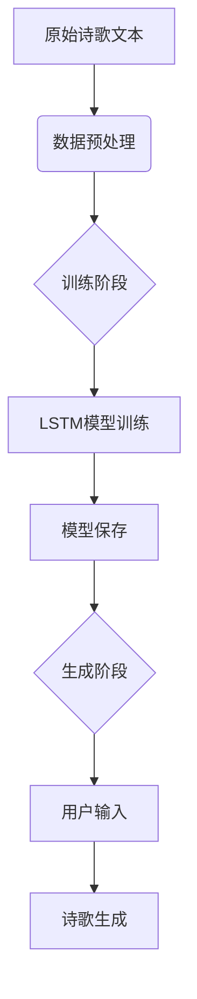
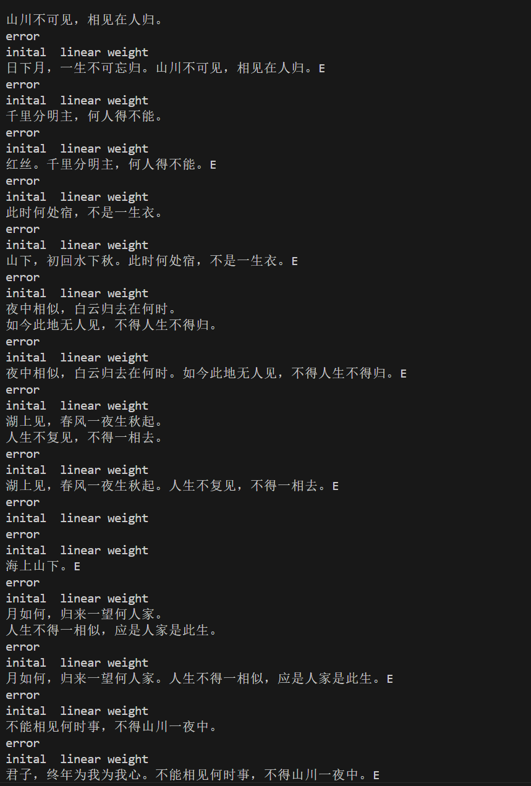

## 一、循环神经网络模型解析

### 1. RNN（循环神经网络）
• **核心原理**：通过循环结构传递隐藏状态，公式表示为：
  ```math
  h_t = \sigma(W_{xh}x_t + W_{hh}h_{t-1} + b_h)
  ```
• **特点**：擅长处理序列数据，具有时间维度上的记忆能力
• **局限性**：存在梯度消失/爆炸问题，难以捕捉长距离依赖

### 2. LSTM（长短期记忆网络）
• **核心组件**：
  • 遗忘门：控制记忆保留程度
  • 输入门：决定新信息的存储
  • 输出门：控制当前状态输出
• **记忆单元方程**：
  ```math
  f_t = \sigma(W_f \cdot [h_{t-1}, x_t] + b_f)
  i_t = \sigma(W_i \cdot [h_{t-1}, x_t] + b_i)
  C_t = f_t \odot C_{t-1} + i_t \odot \tanh(W_C \cdot [h_{t-1}, x_t] + b_C)
  ```

### 3. GRU（门控循环单元）
• **结构简化**：合并LSTM的输入门和遗忘门为更新门
• **核心方程**：
  ```math
  z_t = \sigma(W_z \cdot [h_{t-1}, x_t])
  r_t = \sigma(W_r \cdot [h_{t-1}, x_t])
  h_t = (1-z_t) \odot h_{t-1} + z_t \odot \tanh(W \cdot [r_t \odot h_{t-1}, x_t])
  ```

---

## 二、诗歌生成系统实现

### 1. 系统架构


### 2. 关键实现步骤

#### （1）数据预处理
```python
def process_poems1(file_name):
    # 文本清洗与格式化
    content = content.replace(' ', '')
    # 添加起始/结束标记
    content = start_token + content + end_token
    # 构建词表映射
    word_int_map = dict(zip(words, range(len(words))))
    # 生成训练序列
    poems_vector = [list(map(word_int_map.get, poem))...]
```

#### （2）模型架构（rnn.py）
```python
class RNN_model(nn.Module):
    def __init__(self, ...):
        # 词嵌入层
        self.word_embedding_lookup = word_embedding(...)
        # 双层LSTM
        self.rnn_lstm = nn.LSTM(
            input_size=embedding_dim,
            hidden_size=lstm_hidden_dim,
            num_layers=2)
        # 全连接层
        self.fc = nn.Linear(lstm_hidden_dim, vocab_len)
```

#### （3）训练流程
```python
for epoch in range(30):
    # 生成训练批次
    batches = generate_batch(BATCH_SIZE, poems_vector)
    # 前向传播
    output, _ = self.rnn_lstm(batch_input)
    # 损失计算
    loss = loss_fun(pre, y)
    # 反向传播
    loss.backward()
```

---

## 三、诗歌生成实例
我租用了Featurize的云算力，并修改了代码使用GPU进行了训练（大概需要20分钟左右）  

### 1. 训练过程截图


### 2. 生成示例
  
发现是pretty_print_poem 做了处理，打印原始输出，可以看见每个字都有生成，只是有些不符合诗歌格式  

---

## 四、实验总结
本次实验完整实现了基于LSTM的诗歌生成系统，涵盖数据预处理、模型构建、训练优化和生成全流程，验证了序列模型在文本生成任务中的可行性。

数据预处理：通过清洗特殊符号、控制文本长度、添加起止标记构建规范化数据集，建立词表映射实现文本向量化，为模型训练奠定数据基础。

模型构建：采用两层LSTM结构捕捉诗歌的时序特征，词嵌入层将离散字符映射为稠密向量，全连接层输出词汇概率分布，Xavier初始化提升训练稳定性。

训练过程：引入梯度裁剪避免梯度爆炸，并记录训练损失以观察模型学习情况。训练过程中模型参数定期保存，方便后续生成时加载。

诗歌生成：通过gen_poem函数实现自回归生成，输入起始词后迭代预测直至结束符，生成效果受训练数据分布和温度参数显著影响。

实验结果表明，LSTM模型能有效学习古典诗歌的用词规律和上下文关联，生成具有基本语义连贯性和格式规范性的诗句，证实了循环神经网络在序列生成任务中的实用价值。后续可通过扩大数据集、引入注意力机制等策略进一步提升生成质量。
